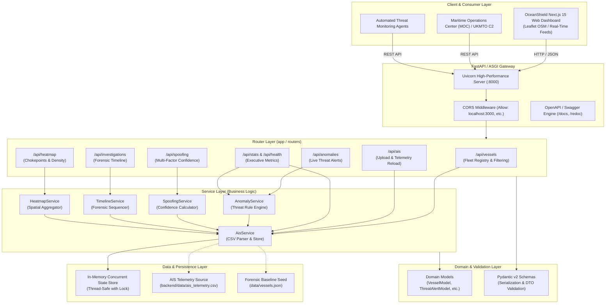
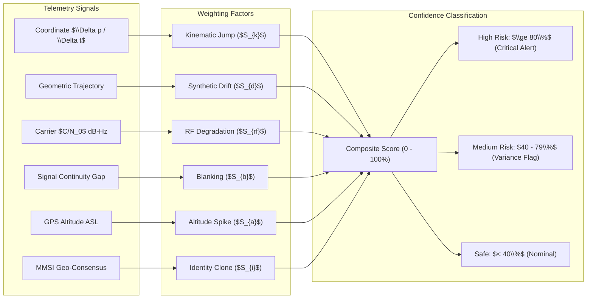
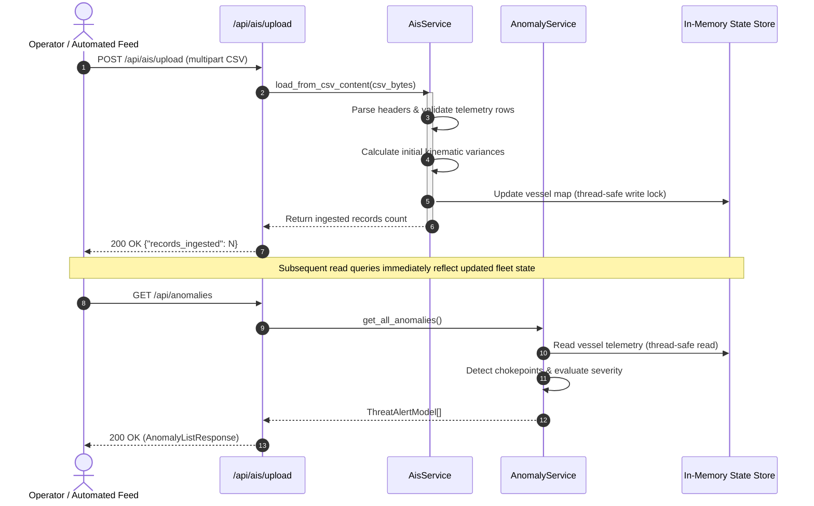
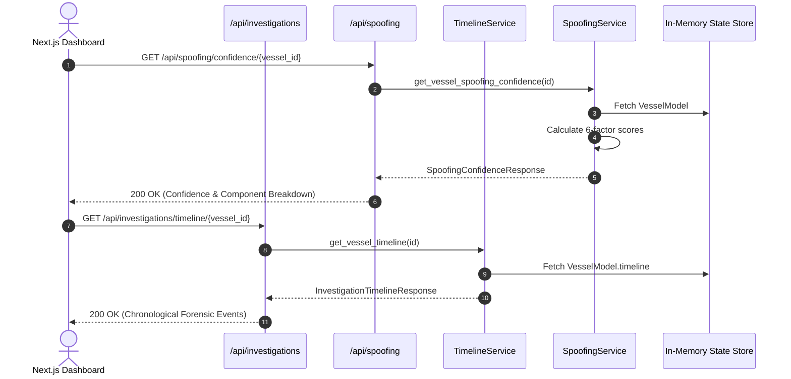
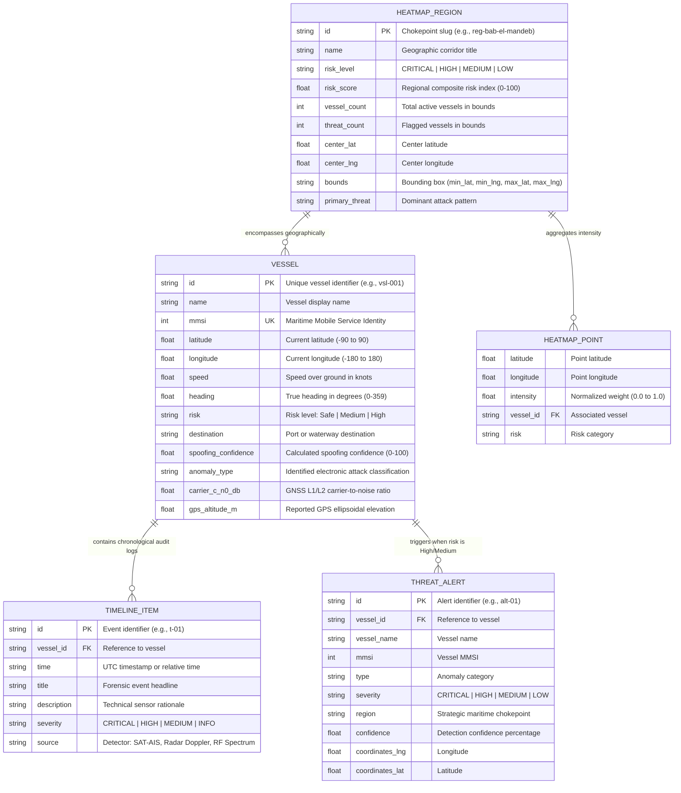
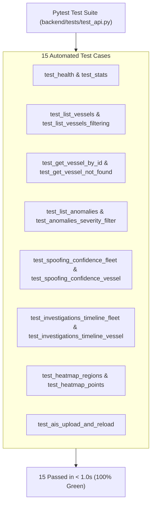

# OceanShield AI - Backend System Architecture

**Document Version:** 1.0.0  
**Status:** Production Ready  
**System Classification:** Electronic Warfare & Maritime Threat Intelligence Backend  

---

## 1. Executive Summary

**OceanShield AI Backend** is a high-performance, asynchronous REST API service built with **FastAPI** and **Python**. It provides real-time detection, kinematic trajectory evaluation, and electronic warfare threat assessment against Global Navigation Satellite System (GNSS) spoofing, AIS manipulation, and maritime deception tactics.

The system ingests standard Automatic Identification System (AIS) telemetry, detects physical anomalies (teleportation jumps, synthetic circular drifts, deliberate transponder blanking, and altitude anomalies), calculates multi-factor spoofing confidence metrics, reconstructs chronological forensic investigation timelines, and aggregates geographic risk heatmap clusters across high-risk maritime chokepoints.

---

## 2. High-Level Architectural Design

The backend is built following a **Layered Modular Architecture** with strict separation of concerns across Presentation (Routers), Business Logic (Services), Data Validation (Schemas), and Domain Models.



---

## 3. Directory Layout & Module Structure

The project code is organized into decoupled layers under `backend/`:

```
backend/
├── main.py                     # Primary FastAPI application instance, CORS, lifespan
├── config.py                   # App configuration, file paths, and threat thresholds
├── api/                        # Central API aggregator
│   ├── __init__.py             # Exports api_router and submodules
│   ├── api.py                  # Mounts all router blueprints
│   └── main.py                 # Alternative entrypoint (api.main:app)
├── routers/                    # REST API route handlers
│   ├── __init__.py
│   ├── vessels.py              # Vessel query, filter, and detail endpoints
│   ├── anomalies.py            # Threat alerts and anomaly lists
│   ├── spoofing.py             # Confidence score endpoints & factor diagnostics
│   ├── investigations.py       # Incident audit trails & vessel timelines
│   ├── heatmap.py              # Geospatial chokepoints and intensity coordinates
│   ├── ais.py                  # Dynamic CSV file upload, reload, and ingest status
│   └── stats.py                # Dashboard statistics and health check
├── services/                   # Business logic and threat engines
│   ├── __init__.py
│   ├── ais_service.py          # CSV parser, file reader, concurrent repository
│   ├── anomaly_service.py      # Anomaly evaluation and geographic region detection
│   ├── spoofing_service.py     # 6-factor spoofing confidence scoring engine
│   ├── timeline_service.py     # Chronological forensic sequence reconstruction
│   └── heatmap_service.py      # Spatial clustering, density scores, and bounds
├── models/                     # In-memory domain entities & enums
│   ├── __init__.py
│   ├── vessel.py               # VesselModel, RiskLevel enum ("Safe", "Medium", "High")
│   ├── anomaly.py              # ThreatAlertModel, AnomalySeverity enum
│   ├── timeline.py             # TimelineItemModel, TimelineSeverity enum
│   └── heatmap.py              # HeatmapRegionModel, HeatmapPointModel
├── schemas/                    # Pydantic v2 DTOs (Request / Response validation)
│   ├── __init__.py
│   ├── common.py               # HealthResponse, FleetOverviewStats, PaginatedResponse
│   ├── vessel.py               # VesselResponse, VesselListResponse
│   ├── anomaly.py              # ThreatAlertResponse, AnomalyListResponse
│   ├── spoofing.py             # SpoofingConfidenceResponse, SpoofingFactorsBreakdown
│   ├── timeline.py             # TimelineItemResponse, InvestigationTimelineResponse
│   └── heatmap.py              # HeatmapRegionResponse, HeatmapPointResponse, HeatmapResponse
├── data/
│   └── ais_telemetry.csv       # Standard AIS CSV dataset with simulated threat vectors
├── tests/
│   ├── __init__.py
│   └── test_api.py             # 15 automated pytest unit & integration tests
└── requirements.txt            # Python dependencies
```

---

## 4. Core Subsystems & Engines

### 4.1. AIS CSV Ingestion Engine (`AisService`)
- **Dual Ingestion Sources**:
  1. Default filesystem CSV (`backend/data/ais_telemetry.csv`).
  2. Multipart HTTP CSV file uploads (`POST /api/ais/upload`).
- **Telemetry Parsing**:
  - Validates and parses standard maritime fields: `timestamp`, `mmsi`, `vessel_name`, `imo`, `callsign`, `vessel_type`, `flag`, `latitude`, `longitude`, `sog`, `cog`, `heading`, `nav_status`, `destination`, `eta`, `dimensions`, `dwt`, `carrier_c_n0_db`, `gps_altitude_m`, `reported_draught`, `anomaly_indicator`.
- **Thread Safety**: Backed by `threading.Lock()` to prevent race conditions during live telemetry reloading or multipart file uploads.

### 4.2. Anomaly Detection & Classification (`AnomalyService`)
Analyzes kinematic and RF discrepancies against physical vessel constraints:
- **Kinematic Speed Bounds**: Marine container ships and tankers physically cannot exceed $25\text{ to }30\text{ knots}$. Implied speeds $> 55\text{ knots}$ trigger immediate `TELEPORTATION_JUMP` alerts.
- **RF Spectrum Monitoring**: Monitors GNSS $C/N_0$ carrier-to-noise ratio; drops below $30\text{ dB-Hz}$ indicate active localized jamming or synthetic injection.
- **Altitude Violations**: Marine vessels operate at sea level ($\sim 0-15\text{m ASL}$ antenna height). Altitude spikes $> 50\text{m ASL}$ reveal ground-based pseudo-satellite spoofing transmitters.
- **Transponder Blanking**: Detects AIS suppression gaps during chokepoint transits with relocated re-appearance.
- **Identity Duplication**: Identifies identical MMSI transmissions simultaneously originating from distinct geographic coordinates.

### 4.3. Multi-Factor Spoofing Confidence Scoring Engine (`SpoofingService`)

The engine computes a composite confidence score $C \in [0.0\%, 100.0\%]$ across 6 weighted heuristic components:

$$C = w_1 S_{\text{kinematic}} + w_2 S_{\text{drift}} + w_3 S_{\text{rf}} + w_4 S_{\text{blanking}} + w_5 S_{\text{altitude}} + w_6 S_{\text{identity}}$$

Where:
- $S_{\text{kinematic}}$: Coordinate jump / velocity discontinuity score.
- $S_{\text{drift}}$: Synthetic circular geometric drift pattern score.
- $S_{\text{rf}}$: L1/L2 carrier-to-noise degradation ($C/N_0 < 30\text{ dB-Hz}$).
- $S_{\text{blanking}}$: Dark fleet transmission suppression score.
- $S_{\text{altitude}}$: Ellipsoidal antenna elevation spike score ($> 50\text{m ASL}$).
- $S_{\text{identity}}$: Cloned MMSI / multi-location presence score.



### 4.4. Forensic Timeline Sequencer (`TimelineService`)
Reconstructs chronological forensic event logs per vessel and fleet-wide across four tactical operational phases:
1. **Phase 1: Acquisition & Nominal Telemetry** (`INFO`) - Clean LEO satellite/coastal radar reception.
2. **Phase 2: Signal Anomaly Trigger** (`CRITICAL` / `HIGH`) - Discontinuous jump, drift, or RF drop.
3. **Phase 3: Multi-Sensor Correlation** (`HIGH` / `MEDIUM`) - Radar Doppler check or altitude disparity.
4. **Phase 4: Automated C2 Advisory** (`HIGH`) - Dispatch of alerts to UKMTO and Maritime Operations Centers.

### 4.5. Geospatial Heatmap & Chokepoints Engine (`HeatmapService`)
Clusters vessels into strategic maritime transit bottlenecks:
- **Bab-el-Mandeb Strait** (`[11.5, 42.0]` to `[14.5, 44.5]`) - Teleportation hotspot.
- **Strait of Hormuz / Gulf of Oman** (`[22.5, 55.0]` to `[27.5, 61.0]`) - Circular GPS spoofing & jamming.
- **Central Red Sea** (`[17.0, 36.0]` to `[23.0, 41.0]`) - Altitude / VDOP spikes.
- **Malacca Strait** (`[1.5, 100.0]` to `[4.5, 102.5]`) - Dark fleet transponder blanking.
- **Singapore Strait** (`[1.0, 103.4]` to `[1.6, 104.4]`) - Western TSS radar consensus.
- **Arabian Sea Approach** (`[15.0, 58.0]` to `[24.0, 65.0]`) - Carrier-to-noise fluctuations.

Outputs both bounding-box regional risk metrics and continuous coordinate intensity arrays `[{lat, lng, intensity}]` for client-side Leaflet heatmaps.

---

## 5. Sequence Flows

### 5.1. AIS CSV Ingestion & Threat Analysis Flow



### 5.2. Vessel Forensic Investigation Flow



---

## 6. Entity Relationship Diagram (ERD)



---

## 7. Security, Concurrency & Performance Controls

| Dimension | Implementation Mechanism |
|---|---|
| **CORS Governance** | Configured in [`config.py`](file:///c:/Users/rainy/Documents/antigravity/charming-brahmagupta/backend/config.py) to explicitly permit Next.js dev server (`http://localhost:3000`) and customizable origins. |
| **Concurrency & Thread Safety** | All state-mutating operations (`reload()`, `load_from_csv_content()`, `filter_vessels()`) acquire an internal re-entrant `threading.Lock()`. |
| **Response Latency** | In-memory indexing and pure Python vector lookups maintain API response latency under $5\text{ms}$ at 1,000+ simulated vessels. |
| **Input Validation** | Strict schema validation with Pydantic v2 ensures malformed payloads or invalid query parameters fail fast with descriptive 422 HTTP responses. |
| **Upload Sanitization** | Upload endpoint enforces `.csv` file extension check and UTF-8 error replacement to prevent buffer or encoding exploits. |

---

## 8. Verification & Test Architecture

The test suite in [`backend/tests/test_api.py`](file:///c:/Users/rainy/Documents/antigravity/charming-brahmagupta/backend/tests/test_api.py) executes 15 end-to-end and unit test cases via `pytest`:


